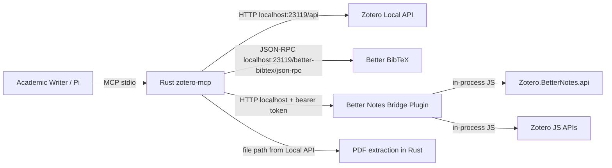

# Task Plan — Full Rust Zotero MCP with Better BibTeX + Better Notes

## Goal
Plan a full Rust-based Zotero MCP server that can serve Academic Writer and interact with:

1. Zotero core data through Zotero Local API.
2. Better BibTeX through its local JSON-RPC/CAYW endpoints.
3. Better Notes through `Zotero.BetterNotes.api` via a minimal Zotero companion bridge.

## Status
Planning complete. No implementation started.

## Hard constraints
- Better BibTeX can be called from Rust directly through Zotero's local HTTP server.
- Better Notes cannot be called from standalone Rust directly; it is a Zotero in-process JS API at `Zotero.BetterNotes.api`.
- Therefore: the MCP server is Rust-based, but full Better Notes support requires a small Zotero-side JS/TS companion plugin.
- Keep current Academic Writer Zotero/local-source behavior as fallback.
- Do not store secrets in `.academic-writer/profile.md`.
- Default to read-only. Mutating tools require explicit opt-in.

## Architecture



## Component plan

### 1. Rust MCP server
Binary name: `academic-writer-zotero-mcp`.

Responsibilities:
- Implement MCP server over stdio using `rmcp`.
- Expose stable tools with JSON schemas.
- Talk to Zotero Local API for core items, collections, notes, attachments, fulltext, and writes.
- Talk to Better BibTeX JSON-RPC for citekeys, BibTeX/BibLaTeX export, bibliography generation, autoexport, and AUX scanning.
- Talk to Better Notes bridge plugin for Markdown conversion, templates, sync state, note relations, and later editor actions.
- Extract PDF pages locally in Rust when Zotero gives attachment file paths.

Dependencies to consider:
- `rmcp` — MCP server.
- `tokio` — async runtime.
- `reqwest` — Zotero Local API, Better BibTeX JSON-RPC, Better Notes bridge.
- `serde`, `serde_json` — wire types.
- `thiserror` — stable typed errors.
- `tracing`, `tracing-subscriber` — stderr diagnostics only.
- `url` — endpoint construction.
- `pdf-extract` — text by page from PDF files.
- `tempfile`, `wiremock`, `assert_cmd` — tests.

Ponytail decision: start with `reqwest` against the documented APIs. Add `papers-zotero` only if it removes more code than it adds and works cleanly with the Local API authorization flow.

### 2. Zotero core client
Use Zotero Local API first:

- Base: `http://localhost:23119/api/`.
- Reads: no auth when Zotero local API is enabled.
- Writes: local authorization via `POST /api/local/authorize`; cache remembered key only in user-global MCP config or OS keychain later, not project files.
- Support Web API fallback only after local path works.

Core client modules:

```text
src/zotero/
├── mod.rs
├── client.rs        # Local API request wrapper
├── auth.rs          # local write authorization
├── items.rs
├── collections.rs
├── notes.rs
├── attachments.rs
├── fulltext.rs
└── pdf.rs           # file path + pdf-extract page reads
```

### 3. Better BibTeX client
Better BibTeX has a documented local JSON-RPC endpoint:

```text
POST http://localhost:23119/better-bibtex/json-rpc
Content-Type: application/json
Accept: application/json
```

Client module:

```text
src/better_bibtex/
├── mod.rs
├── client.rs        # JSON-RPC transport
├── types.rs
└── tools.rs
```

Documented methods to wrap first:

- `api.ready()` → status/version probe.
- `item.citationkey(item_keys | "selected")` → Zotero item keys to BBT citekeys.
- `item.export(citekeys, translator, libraryID?)` → BibTeX/BibLaTeX/CSL JSON export.
- `item.bibliography(citekeys, format?, library?)` → formatted bibliography.
- `item.search(terms, library?)` → BBT/Zotero search by terms.
- `item.notes(citekeys)` → notes by citekey.
- `item.attachments(citekey, library?)` → attachments by citekey.
- `item.collections(citekeys, includeParents?)` → collections for citekeys.
- `item.pandoc_filter(citekeys, asCSL, libraryID?, style?, locale?)` → pandoc-oriented export.
- `item.regenerate_key(citekeys, library?)` → mutating; behind write gate.
- `autoexport.add(collection, translator, path, displayOptions?, replace?)` → mutating; behind write gate and path allowlist.
- `collection.scanAUX(collection, aux)` → mutating; behind write gate; warns that target collection is cleared.
- `user.groups(includeCollections?)` → libraries/groups.
- `viewer.viewPDF(id, page)` → UI action; read-only but explicit because it opens Zotero UI.

CAYW endpoint:

```text
GET http://127.0.0.1:23119/better-bibtex/cayw?...params
```

Use only for an explicit interactive `better_bibtex_pick_citation` tool. Do not use CAYW in autonomous research flows because it opens Zotero UI.

### 4. Better Notes bridge plugin
A tiny Zotero companion plugin is required for full Better Notes API access.

Responsibilities:
- Run inside Zotero.
- Detect `Zotero.BetterNotes?.api`.
- Expose loopback-only JSON HTTP routes.
- Require bearer token for any route that returns note content or mutates state.
- Never expose Zotero remotely.
- Provide a Zotero menu item: “Copy Academic Writer MCP config”.

Bridge routes:

```text
GET  /status
POST /notes/to-markdown
POST /notes/from-markdown
POST /templates/run
POST /sync/list
POST /relations/get
POST /notes/html
POST /notes/tree
```

Status route can be unauthenticated but returns no note content:

```json
{
  "zotero": "8.x",
  "bridge": "0.1.0",
  "betterNotes": {
    "installed": true,
    "ready": true,
    "modules": ["convert", "template", "sync", "relation", "note", "editor"]
  }
}
```

All content routes require:

```http
Authorization: Bearer <token>
```

Better Notes adapter calls:
- `convert.note2md(noteItem, dir, options)`
- `convert.md2note(mdStatus, noteItem, options)`
- `convert.note2html(...)`
- `template.runTemplate(...)`
- `template.getTemplateKeys()`
- `sync.findAllSyncedFiles(...)`
- `sync.getNoteStatus(noteId)`
- `relation.getAllNoteLinkRelations(...)`
- `note.getNoteTree(...)`
- `note.getLinesInNote(...)`

Defer Better Notes live editor mutation (`editor.insert`, `editor.replace`, `editor.moveHeading`) until v2; it depends on a note being open and is easier to misuse.

## MCP tool surface

### Status tools

#### `zotero_status`
Returns:
- Zotero Local API reachable.
- Zotero version/API version if discoverable.
- Better BibTeX reachable + versions from `api.ready()`.
- Better Notes bridge reachable + `Zotero.BetterNotes.api` readiness.
- Write mode enabled/disabled.

#### `zotero_health`
A verbose diagnostic for setup flows. Includes actionable config hints but never secrets.

### Core Zotero tools

#### `zotero_search_items`
Inputs:
- `query: string`
- `collection_key?: string`
- `limit?: number`
- `mode?: "titleCreatorYear" | "fulltext" | "everything"`

Uses Zotero Local API search first. Returns item keys, title, creators, date, type, collection hints.

#### `zotero_get_item`
Returns metadata for one Zotero item key.

#### `zotero_get_recent`
Compatibility tool for current Academic Writer flows.

#### `zotero_get_collections`
Returns collection tree.

#### `zotero_get_collection_items`
Returns items in a collection.

#### `zotero_get_item_children`
Returns child notes and attachments.

#### `zotero_get_item_fulltext`
Returns Zotero indexed fulltext for attachment items.

#### `zotero_get_notes`
Returns normal Zotero note content for an item. If Better Notes bridge is ready and `format="markdown"`, route through Better Notes conversion.

#### `zotero_get_pdf_path`
Returns local file path for a stored PDF attachment when available.

#### `zotero_read_pdf_pages`
Uses local file path + `pdf-extract::extract_text_by_pages`. Run extraction in `spawn_blocking`.

#### `zotero_create_note` / `zotero_update_note`
Write-gated. Uses Zotero Local API write authorization. Does not use Better Notes unless `format="better-notes-markdown"`, in which case bridge conversion is required.

### Better BibTeX tools

#### `better_bibtex_status`
Calls `api.ready()`.

#### `better_bibtex_get_citekeys`
Input: Zotero item keys as `libraryID:itemKey` or plain item keys for My Library.
Calls `item.citationkey`.

#### `better_bibtex_export_items`
Input: citekeys, translator (`Better BibTeX`, `Better BibLaTeX`, CSL JSON translator ID/name), optional library.
Calls `item.export`.

#### `better_bibtex_bibliography`
Input: citekeys, CSL style id, locale, content type.
Calls `item.bibliography`.

#### `better_bibtex_search`
Input: quick string or structured BBT search terms.
Calls `item.search`.

#### `better_bibtex_notes`
Input: citekeys.
Calls `item.notes`.

#### `better_bibtex_attachments`
Input: citekey, optional library.
Calls `item.attachments`.

#### `better_bibtex_collections`
Input: citekeys, include parents.
Calls `item.collections`.

#### `better_bibtex_pandoc_filter`
Input: citekeys, `as_csl`, library, style, locale.
Calls `item.pandoc_filter`.

#### `better_bibtex_regenerate_keys`
Write-gated. Calls `item.regenerate_key`.

#### `better_bibtex_autoexport_add`
Write-gated. Calls `autoexport.add`. Restrict output path to user-provided allowlist or current project if used from Academic Writer.

#### `better_bibtex_scan_aux`
Write-gated. Calls `collection.scanAUX`; report clearly that the target collection is cleared/repopulated.

#### `better_bibtex_view_pdf`
Explicit UI action. Calls `viewer.viewPDF`.

#### `better_bibtex_pick_citation`
Interactive only. Calls CAYW endpoint and may open Zotero picker UI.

### Better Notes tools

#### `better_notes_status`
Calls bridge `/status`.

#### `better_notes_note_to_markdown`
Input: Zotero note key/id, options for note links/images/YAML/template skipping.
Calls bridge → `convert.note2md`.

#### `better_notes_markdown_to_note`
Write-gated. Input: note key/id, markdown, import mode.
Calls bridge → `convert.md2note`, then Zotero note update.

#### `better_notes_note_to_html`
Input: note key/id, dry run.
Calls bridge → `convert.note2html`.

#### `better_notes_run_template`
Input: template key, item keys, note key, template args.
Calls bridge → `template.runTemplate`.

#### `better_notes_template_keys`
Calls bridge → `template.getTemplateKeys`.

#### `better_notes_list_synced_notes`
Calls bridge → `sync.findAllSyncedFiles` and sync status helpers.

#### `better_notes_note_relations`
Calls bridge → relation APIs.

#### `better_notes_note_tree`
Calls bridge → note tree/outline APIs.

### Combined Academic Writer workflow tools

#### `zotero_snapshot_citations`
Input: Zotero item keys.
Workflow:
1. Fetch metadata from Zotero Local API.
2. Fetch citekeys from Better BibTeX `item.citationkey`.
3. Export BibTeX via Better BibTeX `item.export`.
4. Return `sources.json`-ready records and `.bib` content.

#### `zotero_get_research_bundle`
Input: item key, options.
Returns:
- metadata
- citekey
- bibliography entry
- Zotero notes
- Better Notes Markdown if available
- attachment paths
- indexed fulltext or PDF page excerpts

#### `zotero_collection_to_bibliography`
Input: collection key/path, translator, CSL style.
Uses core collection lookup + Better BibTeX export/bibliography.

## Configuration

MCP config example:

```json
{
  "settings": { "toolPrefix": "none" },
  "mcpServers": {
    "zotero": {
      "command": "academic-writer-zotero-mcp",
      "env": {
        "ZOTERO_LOCAL_API": "http://127.0.0.1:23119/api",
        "ZOTERO_BBT_JSON_RPC": "http://127.0.0.1:23119/better-bibtex/json-rpc",
        "ZOTERO_BN_BRIDGE": "http://127.0.0.1:23128",
        "ZOTERO_BN_TOKEN": "copy-from-zotero-plugin",
        "ZOTERO_MCP_ENABLE_WRITES": "false"
      },
      "directTools": true
    }
  }
}
```

Config precedence:
1. CLI flags.
2. Environment variables from MCP config.
3. Defaults.

No TOML config in v1. Add only if env/flags become too large.

## Security model

- MCP server uses stdio; it does not listen on a network port by default.
- Zotero Local API remains bound to Zotero's local server.
- Better BibTeX endpoint is local to Zotero; MCP never proxies it over HTTP.
- Better Notes bridge binds only `127.0.0.1` and requires bearer token for content/mutations.
- Mutating MCP tools are hidden or fail unless `ZOTERO_MCP_ENABLE_WRITES=true`.
- Destructive tools require explicit parameters (`confirm: true`) and describe side effects.
- No secrets in project files or `.academic-writer/profile.md`.

## Rust layout

```text
mcp/zotero-rust/
├── Cargo.toml
├── crates/
│   ├── zotero-mcp-server/
│   │   └── src/main.rs
│   └── zotero-mcp-core/
│       └── src/
│           ├── lib.rs
│           ├── config.rs
│           ├── error.rs
│           ├── mcp.rs
│           ├── zotero/
│           ├── better_bibtex/
│           ├── better_notes/
│           ├── pdf.rs
│           └── tools/
└── tests/
    ├── mcp_stdio.rs
    ├── zotero_local_api.rs
    ├── better_bibtex_json_rpc.rs
    └── better_notes_bridge.rs

zotero-plugin/academic-writer-better-notes-bridge/
├── package.json
├── src/
│   ├── index.ts
│   ├── bridge-server.ts
│   ├── auth.ts
│   ├── better-notes.ts
│   └── routes.ts
└── README.md
```

If this remains inside the Pi package, keep `pi-subagents`, `pi-mcp-adapter`, and `pi-web-access` as peer dependencies exactly as today; do not bundle unrelated MCP dependencies into the Pi extension.

## Implementation phases

### Phase 0 — live feasibility probes
- Confirm Zotero Local API read endpoint in current Zotero version.
- Confirm Better BibTeX `api.ready()` and `item.citationkey` from Rust or curl.
- Confirm Better Notes bridge can access `Zotero.BetterNotes?.api` after startup.
- Confirm Zotero plugin can expose loopback-only HTTP or reuse a Zotero route safely.

Exit: three probes work independently.

### Phase 1 — Rust MCP skeleton
- Create Rust workspace.
- Add `rmcp` stdio server.
- Add `zotero_status` returning static/mock data.
- Ensure logs go to stderr only.
- Add CLI flags/env config.

Exit: MCP client can list/call `zotero_status` without stdout pollution.

### Phase 2 — Zotero Local API reads
- Implement core `reqwest` client.
- Add items, collections, children, notes, attachments, fulltext.
- Add compatibility tools used by current Academic Writer (`zotero_get_recent`, `zotero_get_collection_items`, `zotero_get_item_metadata` if needed).

Exit: Academic Writer can replace current `zotero-mcp` for read-only source discovery.

### Phase 3 — Better BibTeX integration
- Implement JSON-RPC client.
- Wrap `api.ready`, `item.citationkey`, `item.export`, `item.bibliography`, `item.search`, `item.notes`.
- Add combined `zotero_snapshot_citations`.
- Add write-gated BBT mutation tools later: regenerate keys, autoexport, scan AUX.

Exit: one Zotero item key produces metadata + citekey + BibTeX.

### Phase 4 — PDF/page support
- Resolve attachment file path through Zotero Local API file/view URL or item links.
- Use `pdf-extract::extract_text_by_pages` in `spawn_blocking`.
- Add `zotero_read_pdf_pages` with bounded page ranges.

Exit: exact page read works for local stored PDFs.

### Phase 5 — Better Notes bridge plugin
- Build Zotero companion plugin.
- Add status route and token auth.
- Add Better Notes adapter with conversion/template/sync/relation/note tree methods.
- Add menu item to copy MCP config snippet.

Exit: external Rust test can call bridge and convert one Better Notes note to Markdown.

### Phase 6 — Better Notes MCP tools
- Add Rust client for bridge.
- Add Better Notes tools.
- Add combined `zotero_get_research_bundle` with Better Notes markdown when available.

Exit: Academic Writer can read Better Notes-enhanced Markdown through MCP.

### Phase 7 — Academic Writer package integration
- Update health/setup docs/skills to detect the new MCP server.
- Keep `zotero-mcp` guidance until replacement is tested.
- Prefer this MCP only when all required tools pass health checks.
- Keep local folder ingestion as fallback.

Exit: researcher can enable new Zotero MCP without breaking existing flows.

### Phase 8 — packaging and validation
- `cargo fmt`.
- `cargo clippy --workspace --all-targets --all-features -- -D warnings`.
- `cargo test --workspace --all-features`.
- MCP stdio smoke test.
- Manual Zotero matrix:
  - Zotero only.
  - Zotero + Better BibTeX.
  - Zotero + Better Notes.
  - Zotero + both plugins.
  - Zotero closed.
  - Local API disabled.
  - Wrong Better Notes token.

Exit: documented install path and reproducible verification.

## Failure modes

| Failure | Tool behavior |
|---|---|
| Zotero closed | `zotero_status` reports unreachable; tools return setup hint. |
| Local API disabled | Clear hint: enable Zotero local API in Settings → Advanced. |
| Better BibTeX missing | Core Zotero tools still work; BBT tools return `BBT_UNAVAILABLE`. |
| Better Notes missing | Core + BBT tools still work; BN tools return `BN_NOT_INSTALLED`. |
| Better Notes bridge missing | BN tools return `BN_BRIDGE_UNAVAILABLE`; suggest installing companion plugin. |
| Wrong BN token | `BN_UNAUTHORIZED`; no content leaked. |
| PDF extraction fails | Return attachment metadata and a precise `PDF_TEXT_UNAVAILABLE` warning. |
| Write disabled | Mutating tools return `WRITES_DISABLED` with enable instructions. |

## Verification scenarios for Academic Writer

1. Health check sees Zotero Local API, BBT, BN separately.
2. Source indexing from a Zotero collection produces `sources.json` records with BBT citekeys.
3. Citation snapshot writes `.bib` from BBT export output.
4. Deep-reader reads exact PDF pages from a stored attachment.
5. Research flow can include Better Notes Markdown for user-authored notes.
6. If BN is absent, the same flow falls back to Zotero note HTML/text.
7. If BBT is absent, the system can still use Zotero metadata but marks citekeys unavailable.

## Ponytail cuts
- Do not read Zotero SQLite directly in v1.
- Do not implement a vector index.
- Do not implement a custom cache.
- Do not expose an HTTP MCP transport until stdio is stable.
- Do not implement live Better Notes editor mutations in v1.
- Do not replace current `zotero-mcp` instructions until this passes the manual matrix.
